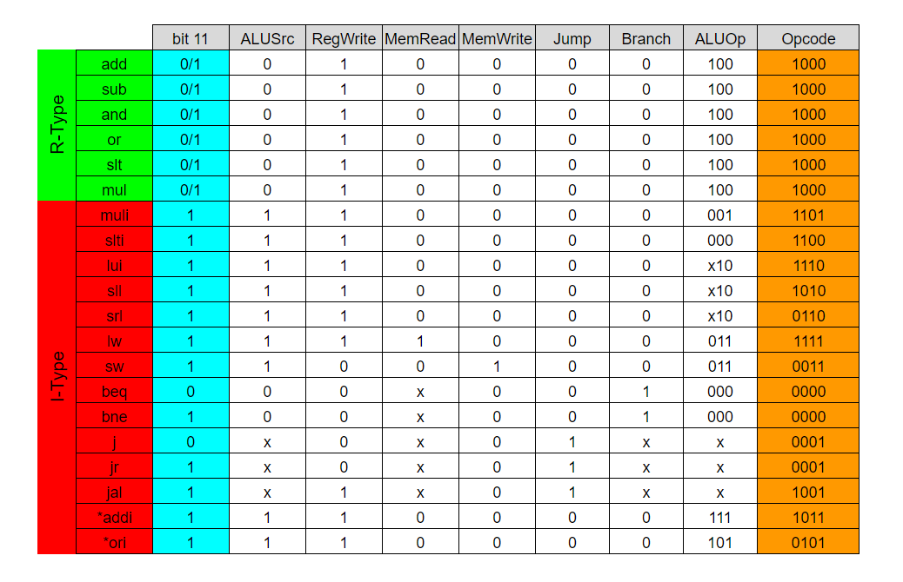
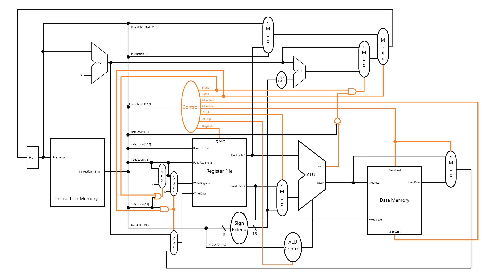
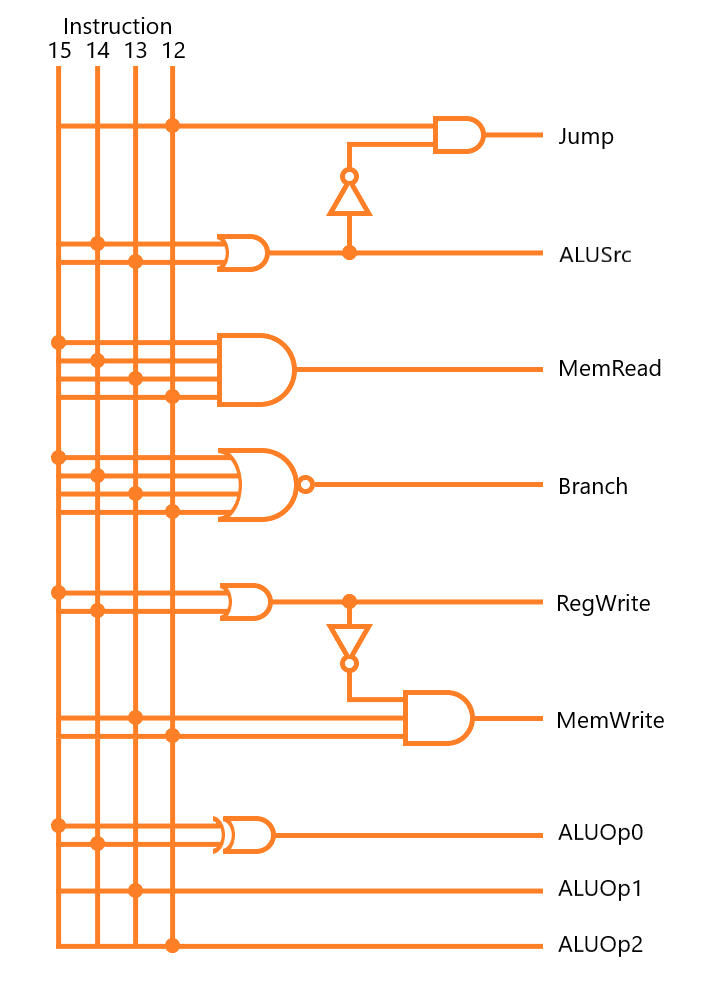

# CPU16-Simulator

CPU16-Simulator is a simulation of 16-bit single-cycle RISC based CPU design which implements necessary instructions that are needed for a regular CPU. Simulation is written in Python 3.7 and Qt5 is used for the GUI.

## Instructions

## Circuit Design
### Complete Circuit Design

### Instruction Control Logic

